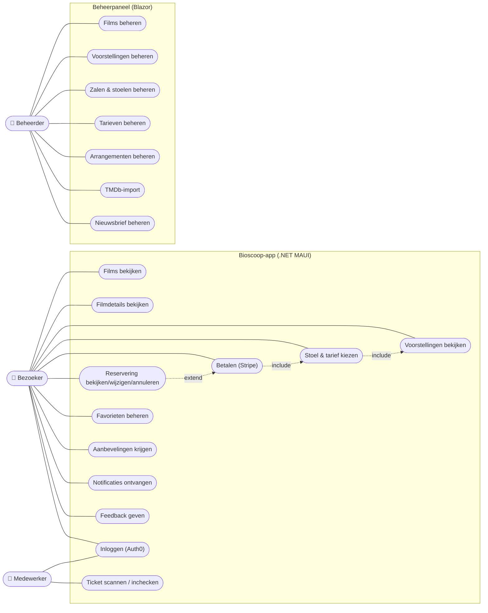
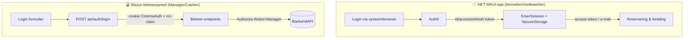
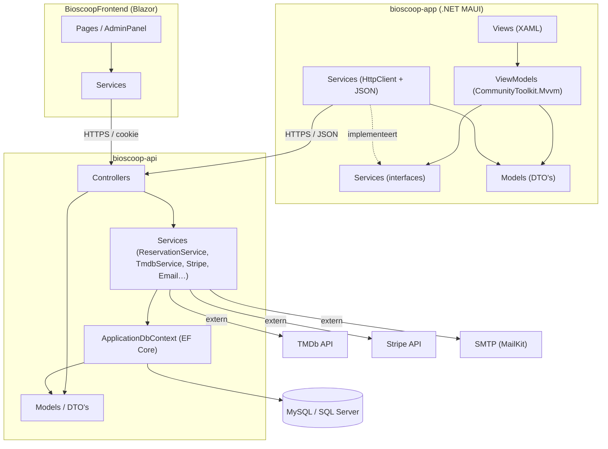
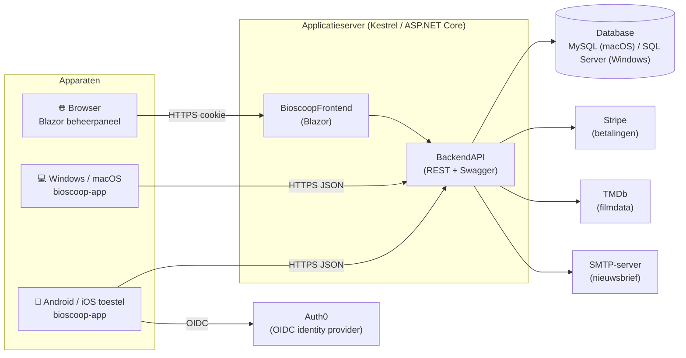
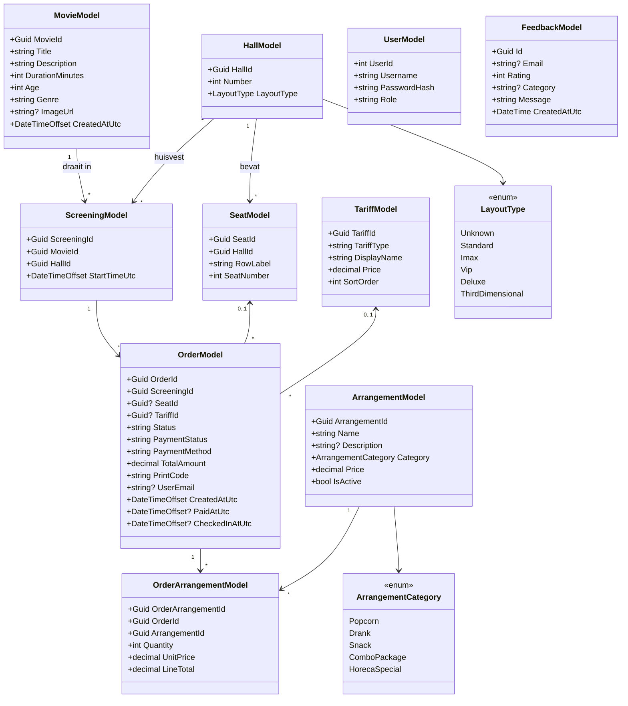
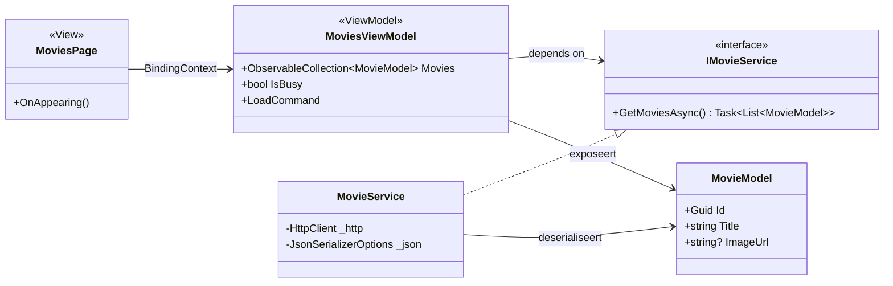
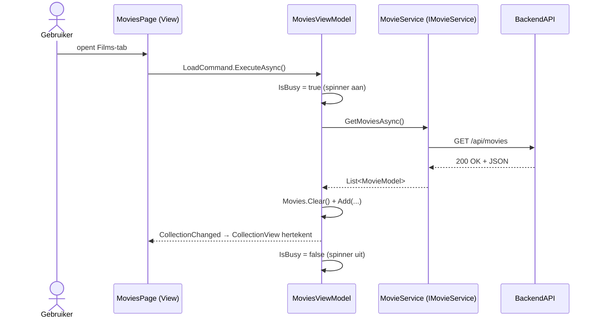
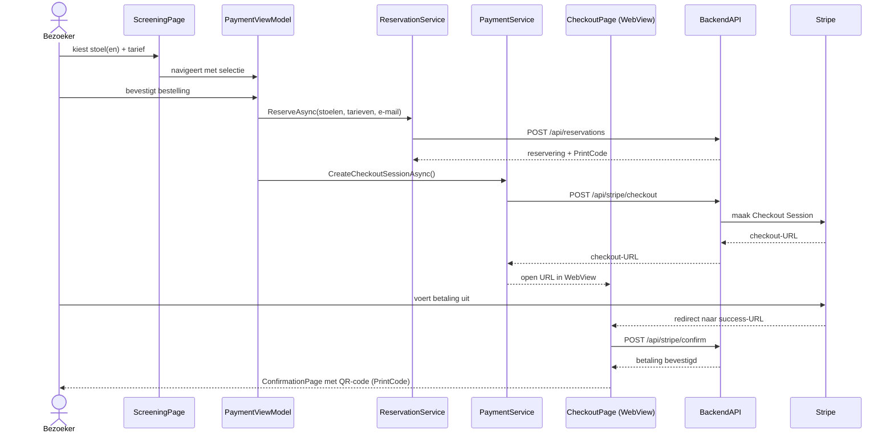
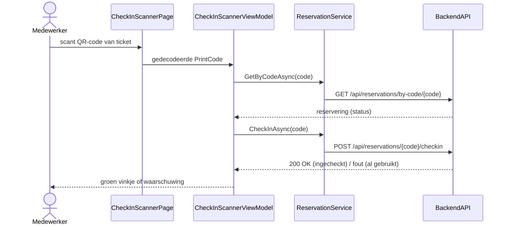

# Bioscoop-app (.NET MAUI)
## Ontwerpdocument

| | |
|---|---|
| **Naam** | _[vul je naam in]_ |
| **Studentnummer** | _[vul je studentnummer in]_ |
| **Opleiding** | AVD AD Informatica |
| **Onderwijsperiode** | OP 2.4 — Portfolio .NET MAUI |
| **Project** | Bioscoop-app + BackendAPI |

---

## Inhoudsopgave

1. [Inleiding](#1-inleiding)
2. [User Stories](#2-user-stories)
   - [Bezoeker](#bezoeker)
   - [Medewerker](#medewerker)
   - [Beheerder](#beheerder)
3. [Use case diagram](#3-use-case-diagram)
4. [Wireframes](#4-wireframes)
5. [Web API-documentatie](#5-web-api-documentatie)
6. [Authenticatie en autorisatie](#6-authenticatie-en-autorisatie)
7. [Package diagram](#7-package-diagram)
8. [Deployment diagram](#8-deployment-diagram)
9. [Klassendiagrammen](#9-klassendiagrammen)
10. [Sequence diagrammen](#10-sequence-diagrammen)
    - [Toelichting MVVM-structuur](#toelichting-mvvm-structuur)
    - [Interactie tussen de .NET MAUI-app en de backend](#interactie-tussen-de-net-maui-app-en-de-backend)

---

## 1. Inleiding

Dit project bestaat uit twee onderdelen die samen één bioscoop-platform vormen:

- **`bioscoop-app`** — een cross-platform **.NET MAUI**-app (Android, iOS, macOS, Windows)
  waarmee bezoekers films bekijken, kaartjes reserveren en betalen, en waarmee
  medewerkers tickets bij de ingang scannen.
- **`bioscoop-api`** — een **ASP.NET Core Web API** (`BackendAPI`) met een MySQL/SQL Server
  database via Entity Framework Core, plus een **Blazor**-beheerpaneel (`BioscoopFrontend`)
  voor het beheer van films, zalen, voorstellingen, tarieven en arrangementen.

De app is opgezet volgens het **MVVM-patroon** met `CommunityToolkit.Mvvm`, waarbij elke
View via dependency injection een ViewModel krijgt en elke ViewModel via een interface een
Service aanspreekt die het HTTP-verkeer met de backend afhandelt (zie hoofdstuk 10).

De User Stories worden iteratief opgepakt, vergelijkbaar met Scrum. Op die manier is er
altijd een werkende applicatie die steeds meer features krijgt; valt een feature uit
(bijvoorbeeld door een beperking in MAUI of in beschikbare tijd), dan blijft de rest van de
app gewoon functioneren.

---

## 2. User Stories

Voor de prioritering is de **MoSCoW**-methode gebruikt: **M**ust have, **S**hould have,
**C**ould have en **W**on't have. Alles wat geen *Must have* is, kan gezien worden als een
wens die toegevoegd wordt als daar tijd voor is.

Er is onderscheid gemaakt tussen drie rollen: de **bezoeker** (de klant die films bekijkt en
reserveert), de **medewerker** (die kaartjes scant aan de ingang) en de **beheerder** (die via
het beheerpaneel de catalogus onderhoudt). Deze rollen sluiten elkaar niet uit — een
medewerker kan ook gewoon bezoeker zijn.

### Bezoeker

| # | Als bezoeker wil ik… | …zodat… | Prioriteit |
|---|---|---|---|
| B1 | een overzicht zien van alle films die nu draaien | ik weet uit welke films ik kan kiezen | Must |
| B2 | de details van een film bekijken (beschrijving, duur, leeftijd, genre, poster) | ik een geïnformeerde keuze kan maken | Must |
| B3 | de voorstellingen (tijden en zalen) van een film zien | ik kan kiezen wanneer ik ga | Must |
| B4 | een stoel kiezen uit een visuele zaalplattegrond | ik op mijn favoriete plek kan zitten | Must |
| B5 | een tarief kiezen (bijv. volwassene, kind, student) | ik de juiste prijs betaal | Must |
| B6 | online betalen via een veilige betaalpagina (Stripe) | ik mijn reservering direct kan afronden | Must |
| B7 | een bevestiging met QR-code/printcode ontvangen | ik mijn kaartje bij de ingang kan tonen | Must |
| B8 | mijn reserveringen terugzien in de app | ik mijn bezoeken kan beheren | Must |
| B9 | inloggen/registreren via Auth0 | mijn reserveringen en voorkeuren bewaard blijven | Must |
| B10 | een film aan mijn favorieten toevoegen | ik die snel terugvind | Should |
| B11 | mijn reservering wijzigen (andere stoelen) of annuleren | ik me kan aanpassen aan veranderingen | Should |
| B12 | aanbevelingen krijgen op basis van mijn favorieten/genres | ik makkelijk nieuwe films ontdek | Should |
| B13 | arrangementen (popcorn, drank, snacks) bij mijn ticket bestellen | ik alles in één keer regel | Should |
| B14 | de bioscopen op een kaart zien | ik weet welke locatie het dichtst bij is | Should |
| B15 | een pushnotificatie krijgen ~30 minuten voor mijn voorstelling | ik op tijd vertrek | Could |
| B16 | een pushnotificatie krijgen als ik in de buurt van de bioscoop ben | ik herinnerd word aan mijn bezoek | Could |
| B17 | mijn notificatievoorkeuren instellen | ik alleen meldingen krijg die ik wil | Could |
| B18 | feedback/een beoordeling achterlaten | de bioscoop de service kan verbeteren | Could |
| B19 | me inschrijven voor de nieuwsbrief | ik op de hoogte blijf van het aanbod | Could |
| B20 | een "secret screening" ontdekken | ik verrast word met een onaangekondigde film | Won't (deze iteratie volledig) |

### Medewerker

| # | Als medewerker wil ik… | …zodat… | Prioriteit |
|---|---|---|---|
| M1 | de QR-/printcode van een ticket scannen met de camera | ik snel toegang kan verlenen aan de ingang | Must |
| M2 | direct zien of een ticket geldig is of al ingecheckt is | ik dubbel gebruik van een kaartje voorkom | Must |
| M3 | een reservering op printcode kunnen opzoeken | ik kan helpen als de QR niet scant | Should |

### Beheerder

> Uitgevoerd via het Blazor-beheerpaneel (`BioscoopFrontend`), niet via de MAUI-app.

| # | Als beheerder wil ik… | …zodat… | Prioriteit |
|---|---|---|---|
| A1 | films toevoegen, wijzigen en verwijderen | de catalogus actueel blijft | Must |
| A2 | voorstellingen (film + zaal + tijd) inplannen | bezoekers kaartjes kunnen kopen | Must |
| A3 | zalen en stoelindelingen beheren | de zaalplattegrond klopt | Must |
| A4 | tarieven beheren | de juiste prijzen gelden | Must |
| A5 | arrangementen beheren | het horeca-aanbod up-to-date is | Should |
| A6 | films importeren uit TMDb | ik snel een rijke catalogus opbouw | Should |
| A7 | nieuwsbrief-abonnees beheren en een mailing versturen | ik bezoekers kan informeren | Could |

> _Tip: verwerk deze User Stories in een scrumboard (bijv. YouTrack of Azure DevOps) en voeg
> hier een screenshot van het board toe als **Figuur 1**._

---

## 3. Use case diagram

---

## 4. Wireframes

Hieronder staan de schermen van de app beschreven, gekoppeld aan de bijbehorende
`Views`. Vervang de beschrijvingen eventueel door echte screenshots/Figma-wireframes.

| Scherm (View) | Beschrijving |
|---|---|
| **`MainPage` / `HomeViewModel`** | Startscherm met aanbevelingen, uitgelichte films en aanbiedingen. Bevat de tabbalk (Home, Favorieten, Reserveringen, Kaart) en de Pathé-titelbalk met profielknop. |
| **`MoviesPage` / `MoviesViewModel`** | Overzicht van alle films in een `CollectionView` met poster, titel en genre. Pull-to-refresh laadt opnieuw. |
| **`MovieDetailPage` / `MovieDetailViewModel`** | Detailpagina: poster, beschrijving, duur, leeftijdskeuring, genre, favorietknop en knop naar de voorstellingen. |
| **`MovieScreenings` / `MovieScreeningsViewModel`** | Lijst met voorstellingen van de gekozen film (datum, tijd, zaal). |
| **`ScreeningPage` / `ScreeningViewModel`** | Visuele **zaalplattegrond**: rijen en stoelen, bezette stoelen geblokkeerd, geselecteerde stoelen gemarkeerd, met tariefkeuze per stoel. |
| **`PaymentPage` / `PaymentViewModel`** | Overzicht van gekozen stoelen, tarieven en optionele arrangementen met totaalbedrag. |
| **`CheckoutPage`** | Ingebouwde `WebView` die de Stripe-betaalpagina toont; success/cancel-redirects worden onderschept. |
| **`ConfirmationPage`** | Bevestiging met **QR-code/printcode** van de reservering. |
| **`ReservationsPage` / `ReservationsViewModel`** | Lijst met de reserveringen van de ingelogde gebruiker (op e-mail), met offline cache. |
| **`ReservationDetailPage` / `ReservationDetailViewModel`** | Detail van één reservering met QR-code, knoppen voor stoelen wijzigen en annuleren. |
| **`EditSeatsPage` / `EditSeatsViewModel`** | Andere stoelen kiezen voor een bestaande reservering. |
| **`FavoritesPage` / `FavoritesViewModel`** | Lijst met films die de gebruiker als favoriet heeft gemarkeerd. |
| **`MapPage`** | Kaart (`Microsoft.Maui.Controls.Maps`) met de bioscooplocaties. |
| **`NotificationPreferencesPage` / `NotificationPreferencesViewModel`** | Schakelaars voor "herinnering vóór voorstelling" en "melding bij aankomst". |
| **`FeedbackPage` / `FeedbackViewModel`** | Formulier voor een beoordeling (rating + categorie + bericht). |
| **`LoginPage` / `ProfilePage`** | Auth0-login en profielweergave (naam, e-mail, foto). |
| **`CheckInScannerPage` / `CheckInScannerViewModel`** | **Medewerkerscherm**: camera-barcodescanner (`BarcodeScanning.Native.Maui`) die de QR-code leest en de reservering incheckt. |

> _Voeg hier de echte wireframes toe als **Figuur 2 t/m n**, bijvoorbeeld:
> MainPage, MovieDetail, ScreeningPage (zaalplattegrond), PaymentPage en ConfirmationPage._

---

## 5. Web API-documentatie

De backend (`BackendAPI`) is gedocumenteerd met **Swagger/OpenAPI** (Swashbuckle). In
Development is de Swagger-UI bereikbaar. Hieronder een overzicht van alle endpoints,
inclusief de vereiste autorisatie.

> Legenda autorisatie: **Anon** = openbaar · **Auth** = ingelogde gebruiker (cookie) ·
> **Manager** = rol `Manager` vereist.

### Movies — `api/movies`
| Methode | Route | Autorisatie | Omschrijving |
|---|---|---|---|
| GET | `/` | Anon | Alle films |
| GET | `/{id}` | Anon | Eén film |
| GET | `/upcoming` | Anon | Binnenkort te verwachten films |
| GET | `/{id}/details` | Anon | Uitgebreide filmdetails |
| GET | `/secret-screening` | Anon | Verborgen "secret screening" |
| POST | `/` | Manager | Film toevoegen |
| PUT | `/{id}` | Manager | Film wijzigen |
| DELETE | `/{id}` | Manager | Film verwijderen |
| POST | `/import?pages=` | Manager | Films importeren uit TMDb |

### Screenings — `api/screenings`
| Methode | Route | Autorisatie | Omschrijving |
|---|---|---|---|
| GET | `/?movieId=` | Anon | Voorstellingen (optioneel per film) |
| GET | `/overview` | Anon | Overzicht van voorstellingen |
| GET | `/{id}` | Anon | Eén voorstelling |
| GET | `/available-seats?movieId=` | Anon | Beschikbare stoelen voor een film |
| GET | `/{id}/seats` | Anon | Stoelen + bezetting voor een voorstelling |
| POST | `/` | Manager | Voorstelling inplannen |
| PUT | `/{id}` | Manager | Voorstelling wijzigen |
| DELETE | `/{id}` | Manager | Voorstelling verwijderen |

### Halls — `api/halls`
| Methode | Route | Autorisatie | Omschrijving |
|---|---|---|---|
| GET | `/` · `/{id}` | Anon | Zalen ophalen |
| POST · PUT · DELETE | `/` · `/{id}` | Manager | Zaal beheren |

### Tariffs — `api/tariffs`
| Methode | Route | Autorisatie | Omschrijving |
|---|---|---|---|
| GET | `/` · `/{id}` | Anon | Tarieven ophalen |
| POST · PUT · DELETE | `/` · `/{id}` | Manager | Tarief beheren |

### Arrangements — `api/arrangements`
| Methode | Route | Autorisatie | Omschrijving |
|---|---|---|---|
| GET | `/?category=` | Anon | Actieve arrangementen (optioneel per categorie) |
| GET | `/categories` | Anon | Beschikbare categorieën |
| GET | `/{id}` | Anon | Eén arrangement |
| GET | `/all` | Manager | Alle arrangementen (incl. inactieve) |
| POST · PUT · DELETE | `/` · `/{id}` | Manager | Arrangement beheren |

### Reservations — `api/reservations`
| Methode | Route | Autorisatie | Omschrijving |
|---|---|---|---|
| POST | `/` | Auth | Reservering aanmaken (app) |
| POST | `/website` | Anon | Reservering via website |
| GET | `/by-code/{code}` | Auth | Reservering op printcode |
| GET | `/by-email/{email}` | Auth | Reserveringen van een gebruiker |
| PUT | `/{code}/seats` | Auth | Stoelen van een reservering wijzigen |
| POST | `/{code}/cancel` | Auth | Reservering annuleren |
| POST | `/{code}/checkin` | Auth | Ticket inchecken (medewerker) |

### Orders & Betaling
| Methode | Route | Autorisatie | Omschrijving |
|---|---|---|---|
| POST | `api/orders` | Auth | Bestelling aanmaken |
| POST | `api/orders/{id}/pay` | Auth | Betaling bevestigen |
| POST | `api/stripe/checkout` | Auth | Stripe Checkout-sessie starten |
| POST | `api/stripe/confirm` | Auth | Stripe-betaling bevestigen |

### Feedback & Nieuwsbrief & Auth
| Methode | Route | Autorisatie | Omschrijving |
|---|---|---|---|
| POST | `api/feedback` | Anon | Feedback/beoordeling indienen |
| POST | `api/newsletter/subscribe` | Anon | Inschrijven op nieuwsbrief |
| GET | `api/newsletter/subscribers` | Manager | Abonnees ophalen |
| DELETE | `api/newsletter/subscribers/{id}` | Manager | Abonnee verwijderen |
| POST | `api/newsletter/send` | Manager | Mailing versturen |
| POST | `api/auth/login` | Anon | Inloggen (beheerpaneel, cookie) |
| POST | `api/auth/logout` | Auth | Uitloggen |
| GET | `api/auth/me` | Auth | Huidige gebruiker |

> _Voeg hier een screenshot van de Swagger-UI toe als **Figuur n**._

---

## 6. Authenticatie en autorisatie

Het platform kent **twee gescheiden authenticatiemechanismen**, passend bij de twee
client-typen:

### 6.1 Mobiele app — Auth0 (OIDC)
De .NET MAUI-app gebruikt **Auth0** via `Auth0.OidcClient.MAUI`. De bezoeker logt in via de
systeembrowser (Authorization Code Flow met PKCE). Belangrijke punten:

- **Configuratie** (`MauiProgram.cs`): domain `dev-…eu.auth0.com`, redirect `myapp://callback/`,
  scope `openid profile email offline_access`.
- **Sessie-herstel**: bij het opstarten (`App.OnStart`) wordt met een opgeslagen
  **refresh token** stil opnieuw ingelogd (`RefreshTokenAsync`), zonder de browser te openen.
  De `IUserSession` bewaart het token veilig (SecureStorage) en houdt de `ClaimsPrincipal` bij.
- De gebruiker hoeft **niet** ingelogd te zijn om films en voorstellingen te bekijken. Een
  account is wél nodig voor reserveren, betalen en favorieten.

### 6.2 Beheerpaneel & API — cookie-authenticatie met rollen
De `BackendAPI` gebruikt **cookie-authenticatie** (`Program.cs`):

- Cookie `CinemaAuth`, `SameSite=None`, `Secure=Always`, sliding expiration van 8 uur.
- Inloggen via `POST api/auth/login`; het wachtwoord wordt geverifieerd met
  `PasswordHasher<UserModel>`. Bij succes wordt een cookie met claims (naam + **rol**) gezet.
- **Twee rollen**: `Manager` (volledige rechten op films, zalen, voorstellingen, tarieven,
  arrangementen en nieuwsbrief) en `Cashier` (kassa/medewerker). Beheer-endpoints zijn
  beveiligd met `[Authorize(Roles = "Manager")]`; lees-endpoints zijn `[AllowAnonymous]`.
- Bij een geweigerde toegang geeft de API netjes **401** of **403** terug in plaats van een
  redirect, zodat de SPA/clients het kunnen afhandelen.
- **CORS** staat alleen de bekende frontend-origins toe (`AllowCredentials`).

---

## 7. Package diagram

---

## 8. Deployment diagram

---

## 9. Klassendiagrammen

### 9.1 Domeinmodel (backend)

### 9.2 Client-architectuur (MAUI, MVVM)

> Hetzelfde drielagenpatroon (View → ViewModel → `I…Service`) geldt voor alle features:
> `IScreeningService`, `IReservationService`, `IPaymentService`, `ITariffService`,
> `IFavoritesService`, `IOfferService`, `IRecommendationService`, `IFeedbackService`,
> `INotificationPreferencesService`, `INotificationScheduler` en `IProximityService`.

---

## 10. Sequence diagrammen

### Toelichting MVVM-structuur

De app volgt strikt het **MVVM-patroon** met `CommunityToolkit.Mvvm` en compiled bindings
(`x:DataType`). Elke laag kent alleen de laag eronder, en alleen via een **interface**:

- **View (XAML)** — uitsluitend declaratieve UI; bindt aan properties en commands van de
  ViewModel. De code-behind bevat alleen `InitializeComponent()`, het zetten van de
  `BindingContext` en eventueel `OnAppearing`.
- **ViewModel** — houdt de state (`[ObservableProperty]`) en commands (`[RelayCommand]`) bij,
  kent géén MAUI-types en doet zelf geen HTTP. Krijgt via DI een service-interface.
- **Service** — bezit de gedeelde `HttpClient` en de JSON-(de)serialisatie en praat met de
  backend. Geregistreerd als **singleton** (zodat er één `HttpClient` is); detail-/edit-VM's
  en hun pagina's zijn **transient**.
- **Model** — eenvoudige DTO-klassen die de JSON van de API spiegelen.

Dependency injection wordt centraal geconfigureerd in `MauiProgram.cs`; niets wordt met de
hand `new`'d. Dit maakt de ViewModels los testbaar (een nep-`IMovieService` met vaste data is
genoeg om `LoadAsync` te testen, zonder MAUI of backend).

### Interactie tussen de .NET MAUI-app en de backend

Onderstaand sequence diagram toont de volledige **reserveer-en-betaal-flow**, het hart van
de interactie tussen app en backend, inclusief Stripe en de QR-bevestiging.

En de **check-in-flow** aan de ingang door een medewerker:

---

_Einde ontwerpdocument._
